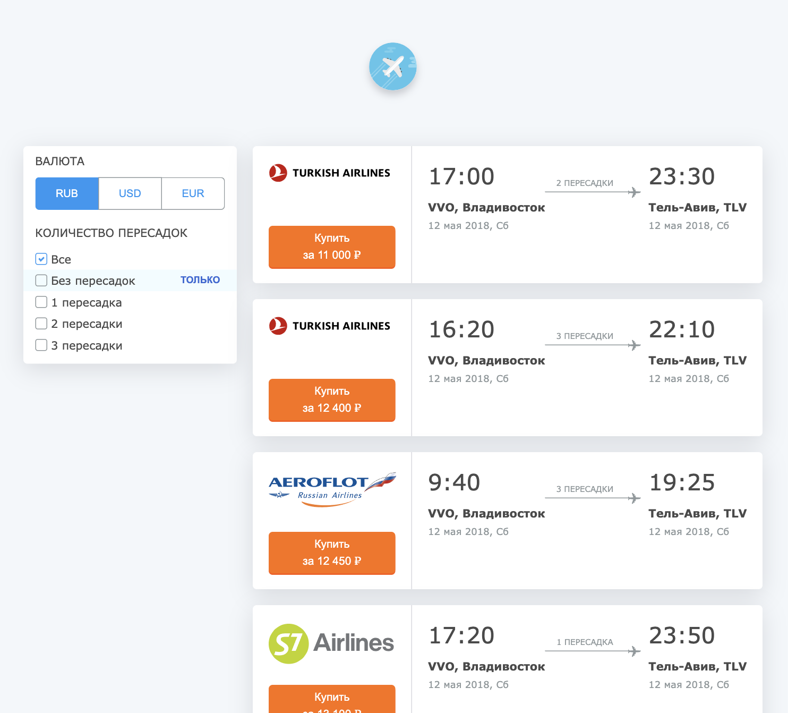

# Airline tickets demo app

Сортировка билетов по количеству пересадок. 

Поддержка IE11, адаптив без адаптива. 

---
### Используемые технологии
- React
- Typescript
- Styled Components
- Context
 ---
### Ссылка на опубликованную версию:
https://pestrige.github.io/airline-tickets/

---
### Превью:

---
### Инструкции:
1. Клонируйте репозиторий на локальную машину:
~~~
git clone git@github.com:pestrige/airline-tickets.git
~~~
2. Перейдите в папку проекта:
~~~
cd airline-tickets
~~~
4. Установите зависимости:
~~~
npm install
~~~
5. Запустите проект командой:
~~~
npm start
~~~
